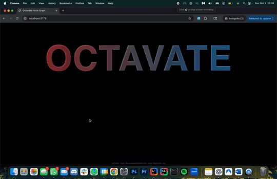

# Music Industry Relationship Visualization

## About
This project is an interactive 3D visualization of relationships in the music industry. It explores connections between artists and related entities using a large-scale dataset processed in Python and rendered using JavaScript.

---

## Demo

---

## Features
- Interactive 3D network visualization of music industry relationships
- Python-based processing of 900,000+ relationship records
- JavaScript rendering for real-time exploration of connections
- Scalable handling of large graph-style datasets

---

## Tech Stack
- Python (data processing / preprocessing)
- JavaScript (3D visualization)
- JSON (large-scale relationship data)

---

## Purpose
To visually explore and analyze complex relationships within the music industry at scale.
